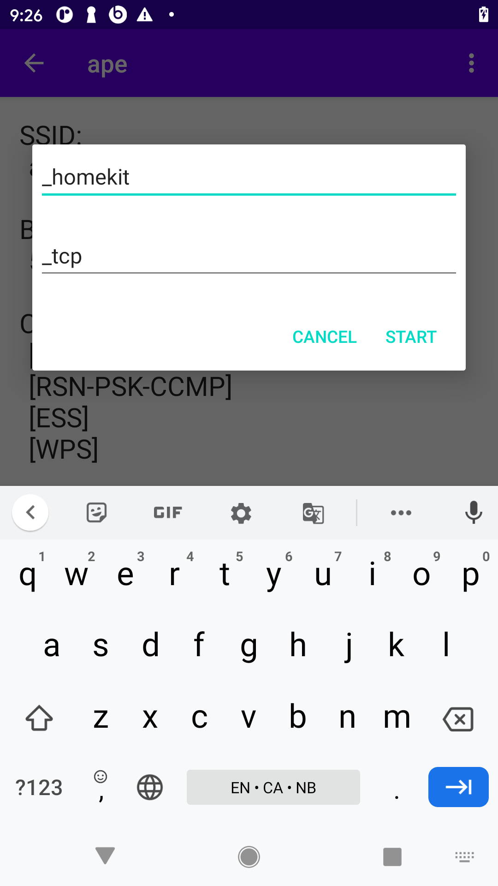
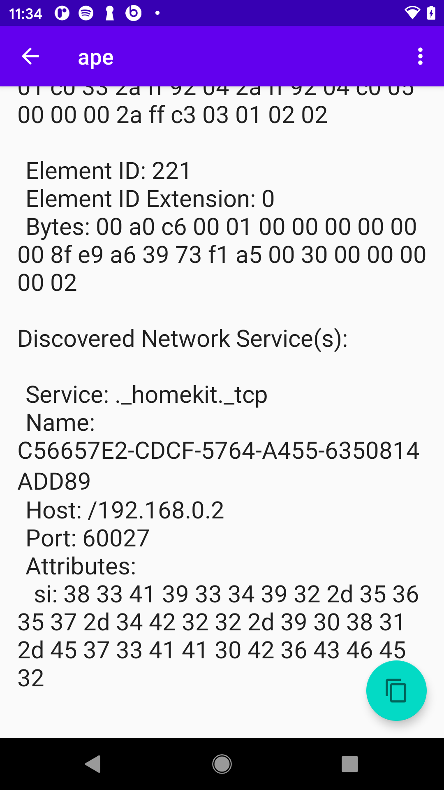

# Wi-Fi Tool

A simple tool to

* View visible Wi-Fi networks
* View details about a Wi-Fi network
  * Center frequency and more (requires API level 23)
  * Information elements (requires API level 30)
* Attempt connection to open and WPA3 or WPA2 Wi-Fi networks
  * Perform service discovery on connected network
  * Rotate screen or hit back button to leave Wi-Fi network automatically

## Screenshots

