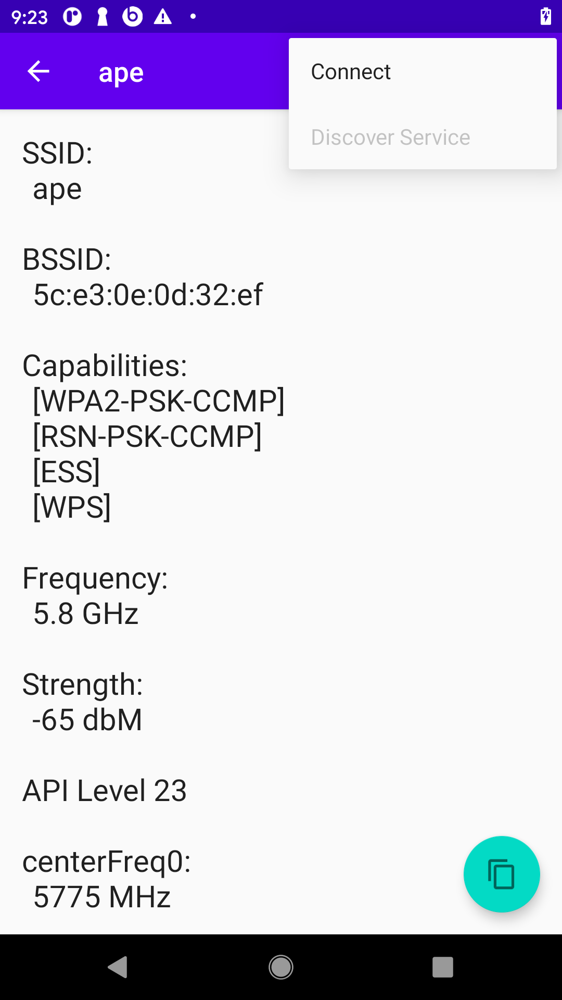

# Wi-Fi Tool

A simple tool to

- View visible Wi-Fi networks
- View details about a network such as center frequency (requires API level 23)
- View information elements (requires API level 30)
- Attempt connection to open and WPA2 Wi-Fi networks

## Screenshots

